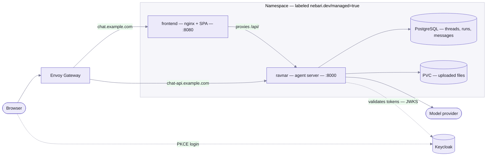

## Two services, one protocol

The pack is a client and a server that agree on [AG-UI](https://docs.ag-ui.com/introduction).
The frontend has no idea which models or agents exist; the backend has no idea what the UI looks
like. Everything specific to a deployment lives in configuration on one side or the other.

Two `NebariApp` resources — one per service — are all the pack tells the platform. The
[nebari-operator](https://github.com/nebari-dev/nebari-operator) turns each into an HTTPRoute, a
certificate, Keycloak clients, and (for the UI) a landing-page tile. The chart also renders the
release namespace with `nebari.dev/managed=true`; without that label the operator ignores both
resources and nothing is routed.

## The request path

A message travels:

1. The browser POSTs `/api/threads/{id}/runs` **to its own origin**, with the Keycloak access
   token attached.
2. nginx in the frontend container proxies `/api/` to the backend Service, forwarding the
   `Authorization` header and disabling buffering so the SSE stream flows through unbroken.
3. Ravnar validates the token, resolves the caller's permissions, and hands the run to the
   configured agent.
4. The agent streams AG-UI events back — text deltas, tool calls, activity snapshots — which the
   proxy passes through to the browser as they are produced.
5. If the agent called a browser-side tool, the run ends without a result for it; the frontend
   executes the tool and submits a follow-up run. See [the run loop](/tools/#the-run-loop).

Because the UI proxies same-origin, the browser never makes a cross-origin request and CORS never
enters the picture. The API's own hostname exists for direct API clients.

## Authentication

Both halves point at the same realm — the chart derives them from the single top-level
`keycloak.*` values, so they cannot drift apart.

### The UI — app-native OIDC

The frontend's `NebariApp` sets `auth.enforceAtGateway: false` and provisions a **public SPA
client** (`auth.spaClient`). The gateway therefore does not intercept the request; the app logs
the user in itself:

1. Before React mounts, the app fetches `/config.json` and reads the Keycloak `url`, `realm`, and
   `clientId` from it. Initializing eagerly, rather than lazily inside a login call, is what keeps
   post-login redirects from looping.
2. `keycloak-js` runs the PKCE login flow against the realm.
3. Every API call goes through a fetch wrapper that refreshes the token if needed and attaches
   `Authorization: Bearer <token>`. The wrapper captures the native `fetch` at module load, so
   code that later monkey-patches `window.fetch` cannot observe the token.

Since the client id comes from a runtime file rather than the bundle, the same image works
against any realm.

### The backend — bearer tokens, verified in-process

`security.authenticator` in the backend config builds a Ravnar `BearerTokenAuthenticator` over an
OIDC validator for `{keycloak.url}/realms/{keycloak.realm}`. Every request is validated against
the realm before it reaches an agent, and a validated caller is granted the full Ravnar
permission set. Narrower authorization means supplying your own authenticator — see
[Agents & models](/agents/#authentication).

The backend's `NebariApp` carries **no auth block**, so the API hostname is not gated at the
gateway: the token check inside Ravnar is what protects it. Anything you place in front of that
hostname (network policy, additional gateway auth) is a deployment choice, not something the
chart assumes.

### Local development

Building the frontend with `VITE_AUTH_ENABLED=false` removes `keycloak-js` from the picture
entirely — no login, no header — and a Ravnar with no configured authenticator treats the caller
as a local user with every permission. Convenient locally; never how you deploy.

## Configuration flow

Two files decide how a deployment behaves, and neither requires an image rebuild:

| File | Consumed by | Rendered from |
| --- | --- | --- |
| `/config.json` | The browser, before React mounts | The chart's frontend ConfigMap (`keycloak.*` + `frontend.branding`), or environment variables at container start outside Kubernetes. See [Branding & configuration](/branding/). |
| `/var/ravnar/helm/config.yaml` | The Ravnar process, at boot | `config.inline` deep-merged with the chart's `security.authenticator` block. See [Agents & models](/agents/). |

nginx additionally renders `${API_URL}` into its config at container start, so the same image can
point at any backend.

## State

- **PostgreSQL** (a StatefulSet from the `ravnar` subchart) stores threads, runs, and messages.
  The chart generates and persists a password unless you supply one, and injects the DSN as
  `RAVNAR_STORAGE__DATABASE__DSN`. Set `ravnar.postgres.enabled=false` to bring your own.
- **A PersistentVolumeClaim** holds uploaded files at `/var/ravnar/files`.
- The **frontend is stateless** — it is nginx serving a static bundle plus a proxy. Scale it
  freely.

Thread history is server-side, so a user's conversations follow them across browsers and devices.
If `storage.enabled` is false, the UI refuses to load rather than pretending to remember.

## Security posture

- Both containers run as non-root (uid 1000). The backend runs with a read-only root filesystem;
  the frontend disables privilege escalation and writes only to `/tmp/nginx`.
- Config is mounted read-only. The frontend's entrypoint only generates `/config.json` when the
  file is writable, so a ConfigMap or `docker -v ...:ro` mount can never be overwritten by
  environment variables.
- Branding values are sanitized before they touch the DOM: logo and favicon URLs must be
  root-relative, `http(s)`, or a base64 image `data:` URI, and theme tokens containing CSS
  injection vectors (`;`, `{`, `}`, quotes, `url(`, `expression(`, `javascript:`) are dropped.
- The access token lives only in the `keycloak-js` instance and is attached by a fetch wrapper
  that closed over the native `fetch`.
- Agent tools run with whatever access you give them. The demo database tools execute
  model-written SQL, so connect them with a read-only role — the read-only guarantee belongs to
  the database grant, not the tool. See [Tools](/tools/#the-database-tools-are-read-only-by-convention).
